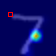
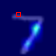
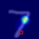
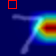
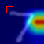
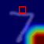
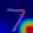
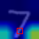

# Non-local_pytorch
- Implementation of [**Non-local Neural Block**](https://arxiv.org/abs/1711.07971).

## Statement
- You can find different kinds of non-local block in **lib/**. 

- You can **visualize** the Non_local Attention Map by following the **Running Steps** shown below.

- The code is tested on MNIST dataset. You can select the type of non-local block in **lib/network.py**.

- If there is something wrong in my code, please contact me, thanks!

## Environment
- python 3.7.3
- pytorch 1.2.0
- opencv 3.4.2

## Visualization
1. In the **first** Non-local Layer.

    

2. In the **second** Non-local Layer.

    


## Running Steps
1. Select the type of non-local block in **lib/network.py**.
    ```
    from lib.non_local_concatenation import NONLocalBlock2D
    from lib.non_local_gaussian import NONLocalBlock2D
    from lib.non_local_embedded_gaussian import NONLocalBlock2D
    from lib.non_local_dot_product import NONLocalBlock2D
2. Run **demo_MNIST_train.py** with one GPU or multi GPU to train the Network. Then the weights will be save in **weights/**.
    ```
    CUDA_VISIBLE_DEVICES=0,1 python demo_MNIST.py

3. Run **nl_map_save.py** to save NL_MAP of one test sample in **nl_map_vis**.
    ```
    CUDA_VISIBLE_DEVICES=0,1 python nl_map_save.py
    
4. Come into **nl_map_vis/** and run **nl_map_vis.py** to visualize the NL_MAP. (tips: if the Non-local type you select is **non_local_concatenation** or **non_local_dot_product** (without Softmax operation), you may need to normalize NL_MAP in the visualize code)
    ```
    python nl_map_save.py

## Update Records
1. Figure out how to implement the **concatenation** type, and add the code to **lib/**.

2. Fix the bug in **lib/non_local.py** (old version) when using multi-gpu. Someone shares the 
reason with me, and you can find it in [here](https://github.com/pytorch/pytorch/issues/8637).

3. Fix the error of 3D pooling in **lib/non_local.py** (old version). Appreciate 
[**protein27**](https://github.com/AlexHex7/Non-local_pytorch/issues/17) for pointing it out.

4. For convenience, I split the **lib/non_local.py** into four python files, and move the 
old versions (**lib/non_loca.py** and **lib/non_local_simple_version.py**) into 
**lib/backup/**.

5. Modify the code to support pytorch 0.4.1, and move the code supporting pytorch 0.3.1 \
to **Non-Local_pytorch_0.3.1/**.

6. Test the code with pytorch 1.1.0 and it works.

7. Move the code supporting pytorch 0.4.1 and 1.1.0 to **Non-Local_pytorch_0.4.1_to_1.1.0/** (In fact, I think it can also support pytorch 1.2.0).

8. In order to visualize NL_MAP, some code have been slightly modified. The code **nl_map_save.py** is added to save NL_MAP (two Non-local Layer) of one test sample. The code **Non-local_pytorch/nl_map_vis.py** is added to visualize NL_MAP. Besieds, the code is support pytorch 1.2.0.


## Todo
- Experiments on Charades dataset.
- Experiments on COCO dataset.


## Related Repositories
1. [**Non-local ResNet-50 TSM**](https://github.com/MIT-HAN-LAB/temporal-shift-module) 
([**Paper**](https://arxiv.org/abs/1811.08383)) on Kinetics dataset. They report that their model achieves a good performance 
of **75.6% on Kinetics**, which is even higher than Non-local ResNet-50 I3D 
([**Here**](https://github.com/AlexHex7/Non-local_pytorch/issues/23)).